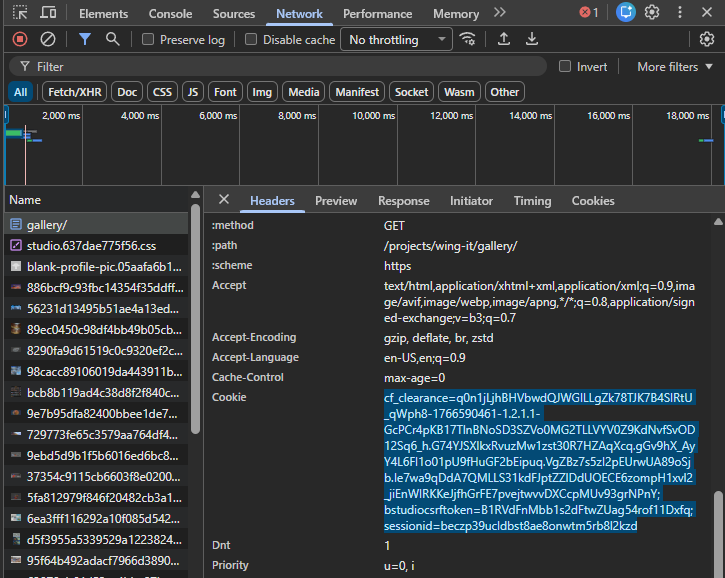

## CG Production Asset Downloader

### Batch download open source assets from Blender Studio

This script can be used to batch download assets from Blender Studio. While their assets are open source, Blender asks that you have a subscription to Blender Studio to download files. If you intend to use this script, please be sure to get a subscription to support the work being done byBlender. [Blender Studio](https://studio.blender.org/)

This script is not affiliated with Blender or Blender Studio. All assets downloaded are created by Blender Studio and available under the [Creative Commons Attribution 4.0 International](https://creativecommons.org/licenses/by/4.0/) license.

## Usage

Run commands from the **metadata extractor repository root** in an isolated Python environment. Install only the downloader dependencies:

```powershell
python -m pip install -r asset_downloader/requirements.txt
```

1. Add `USER_COOKIE` to the extractor-root `.env`, using `asset_downloader/.env.example` as a template. If `.env` already exists, preserve its database and storage settings; do not overwrite it. See the screenshot below for locating the cookie. `.env` is gitignored.
2. Leave `asset_downloader/.env` absent so `load_dotenv()` finds the parent `.env`; an already-set environment variable takes precedence. Cookie validation occurs before argument parsing, including `--help`.
3. Run the script, passing the gallery URL you want to download assets from:

```
python asset_downloader/download_assets.py https://studio.blender.org/projects/<project>/<gallery-id>/
```

By default assets are saved to `cg-production-data/<project-name>/`. Pass `--dir` to save somewhere else:

```
python asset_downloader/download_assets.py https://studio.blender.org/projects/<project>/<gallery-id>/ --dir "cg-production-data/shows/caminandes_llamigos/vr_demo/"
```



## Extraction and S3

Set scanner `DATA_PATH` to the downloaded directory. For example, download Sintel into `cg-production-data/shows/sintel/` to match the existing Compose configuration's `/app/cg-production-data/shows/sintel/` container path. Other projects require updating Compose's `DATA_PATH`; its explicit environment settings are not replaced merely by editing `.env`.

Downloading does not upload files to S3, unpack archives, or run the scanner. These remain separate operations. The [S3 unzip helper](lambda_unzip_function/lambda_instructions.md) retains its existing deployment and behavior, including deleting the source ZIP after extraction. Downloader dependencies remain separate from extractor dependencies, and the downloader is not included in the scanner image.

## Import provenance

Snapshot imported from [CG_Production_Asset_Downloader](https://github.com/CameronDetig/CG_Production_Asset_Downloader) at commit `0318d538a94eb0d596604435ad146e25bc2e4253`. Application code, dependency list, environment example, image, and Lambda instructions are unchanged. This README and the contributor guide were adapted for their new location. The original repository remains available for history; this directory is ordinary source code, not a submodule.
